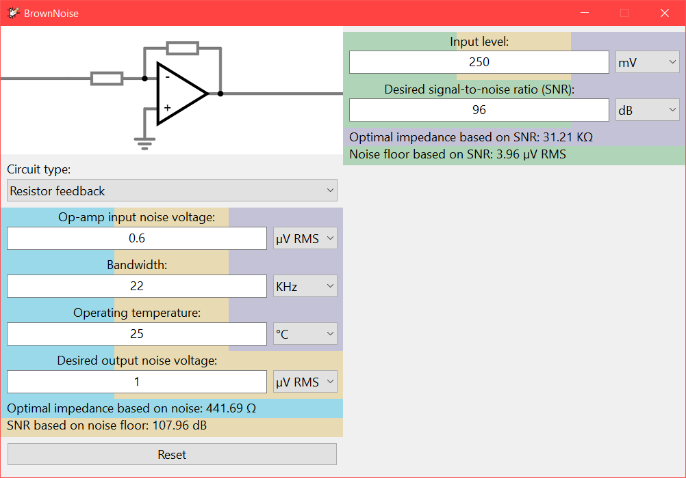
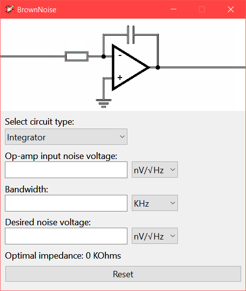

# BrownNoise

> An app for desigining resistor network impedance in op-amp circuits based on desired noise floor

**Please note that the application is currently under heavy development.**

As the name suggests, there's something up with Brownian motion. The original objective of this application is to calculate thermal noise, but since thermal noise is itself inherently random it suggest Brownian motion. Thus the name BrownNoise was born.

This application allows users to enter in desired operating temperature and op-amp characteristics (especially noise voltage) of the circuit in mind. Also the desired noise floor voltage should be entered. Then the application calculates the optimal input impedance for the op amp. The program also supports capacitive loading calculations helping to choose the optimal capacitor for an integrator or differentiator type op-amp circuit.

### Normal feedback mode

### Integrator (capacitive) feedback mode

# Obtaining

32-bit (x86) & 64-bit (x64) Windows binaries can be obtained [here](https://github.com/makuke1234/BrownNoise/releases).

# Changelog

* 0.1
	* [x] Initial working beta release

# License

This project uses the MIT license.

# Credits

Resistor icon: 
<a href="https://www.flaticon.com/free-icons/resistor" title="resistor icons">Resistor icons created by Freepik - Flaticon</a>
